# TrueROAS — User Experience & Interaction Architecture (EXPERIENCE.md)

## 1. Foundation & Platform Architecture
- **Target Form Factors:** Responsive Modern Web (Desktop-first financial modeling, optimized for Tablet and Mobile quick audits).
- **Core Technology Stack:** React (Vite) + TypeScript + Tailwind CSS (v4) + `react-i18next` + Local/Session dual-tier storage.
- **Visual Identity Token Binding:** All components and layouts strictly consume `{tokens.*}` defined in `DESIGN.md` and `src/theme/tokens.ts`.

---

## 2. Information Architecture (IA) & Surface Hierarchy

```mermaid
graph TD
    AppRoot["App Root (Dual-Storage & Theme/i18n Provider)"]
    Header["Global Header (Sticky)"]
    
    Header --> ProjectTitleEdit["Inline Project Title Editor"]
    Header --> ViewSwitch["View Switcher (Dashboard / Calculator)"]
    Header --> ThemeSwitch["Theme Mode (Light / Dark / Auto)"]
    Header --> LangSwitch["Language Switch (English / العربية)"]
    Header --> CurrencySwitch["Global Currency Selector (8 Currencies)"]
    Header --> GlobalImport["CSV / Excel Import Modal"]
    Header --> GlobalExport["Excel Portfolio & PDF Exporter"]
    Header --> AddProductTrigger["Add Product Modal Trigger"]
    
    AppRoot --> ViewRouter{"Active View Router"}
    
    ViewRouter -->|view === 'dashboard'| MainDashboard["View 1: Main Portfolio Dashboard"]
    MainDashboard --> HeroBanner["Hero Welcome Banner & Quick Actions"]
    MainDashboard --> PortfolioKPIs["4 Blended KPI Summary Cards"]
    MainDashboard --> ProductsTable["Searchable, Sortable Products Table"]
    ProductsTable --> ProductRowActions["Row Actions (Open Calc, Duplicate, Delete)"]
    
    ViewRouter -->|view === 'calculator'| ProductCalculator["View 2: Product Deep-Dive Calculator"]
    ProductCalculator --> ProductHeader["Back Button & Instant Switcher Dropdown"]
    ProductCalculator --> UnitEconomicsCard["Unit Economics & Fulfillment Rate Slider"]
    ProductCalculator --> FixedCostsCard["Dynamic Overheads & Fixed Costs Manager"]
    ProductCalculator --> AdSpendCard["Bi-directional CPA & Total Ad Budget Synchronizer"]
    ProductCalculator --> HeroROASCards["Hero Break-Even ROAS vs Current Campaign ROAS"]
    ProductCalculator --> UnitBreakdownCard["Adjusted Profit / Unit & Net Margin Summary"]
    ProductCalculator --> CostBreakdownVisual["Stacked Visual Revenue Waterfall Bar"]
    ProductCalculator --> ComparativeMatrixCard["Raw vs Fulfillment-Adjusted Matrix Table"]
    ProductCalculator --> SensitivityMatrixCard["5x5 Sensitivity Simulation Heatmap"]
```

---

## 3. Voice & Tone (Microcopy Guidelines)
- **Direct & Actionable:** Instead of generic labels like "Settings" or "Data", use clear commercial terminology like *"Fulfillment Rate"*, *"Break-Even ROAS"*, *"Failed Delivery Drag"*, and *"Realized Net Margin"*.
- **Arabic Translation Standard:** Clean, standard commercial Arabic (*"نقطة التعادل للـ ROAS"*, *"نسبة الاستلام والتوصيل"*, *"صافي الربح الفعلي"*), avoiding robotic machine translation.
- **Empathetic Risk Feedback:**
  - When a product is underperforming: *"Below Break-Even ROAS threshold (Campaign is operating at a loss)"*.
  - When fulfillment is low: *"High Return Risk — Overheads & lost shipping eat into margins"*.

---

## 4. Behavioral Component Patterns

### 4.1 Bi-Directional CPA & Total Ad Spend Synchronizer
- **User Mental Model:** Some media buyers think in terms of *"Cost per Acquisition ($15 CPA)"*, while others think in *"Total campaign budget allocated ($7,500 total spend across 500 units)"*.
- **Behavioral Rule:**
  - In `per-unit` (CPA) mode: Updating CPA immediately computes `totalAdSpend = CPA * units`.
  - In `total` budget mode: Updating Total Ad Spend immediately computes `CPA = totalAdSpend / units`.
  - Modifying `batch units` recalculates the secondary metric synchronously without jarring layout shifts.

### 4.2 Fulfillment Rate Drag Calculator (The COD / E-Commerce Shield)
- **The Core Problem:** 100% of e-commerce returns or failed COD deliveries result in:
  1. $0 realized revenue.
  2. 100% loss on forward/return shipping cost per failed parcel.
  3. 100% loss on ad spend allocated to that order.
- **Behavior:** The dynamic slider provides instant, real-time recalculation of:
  - Realized Delivered Units vs Failed Returned Units.
  - Adjusted Net Profit and Adjusted Break-Even ROAS.
  - True Delivery Drag loss in monetary figures.

### 4.3 Dual-Storage Zero-Loss Engine
- **Persistence Guarantee:** Every user keystroke, slider drag, product addition, overhead edit, and deletion writes synchronously to `window.localStorage` and `window.sessionStorage`.
- **Hooks & Listeners:** Synchronous event listeners on `beforeunload`, `pagehide`, and `visibilitychange` flush state instantly to eliminate data loss upon browser crashes, rapid tab closures, or accidental page reloads (`F5`).

---

## 5. State Patterns & Edge Cases

| State / Edge Case | System Behavior | Visual Feedback |
| :--- | :--- | :--- |
| **Zero Selling Price or COGS $\ge$ Price** | Margin $\le$ 0. Break-even ROAS is impossible. | Displays `N/A` with clear warning badge *"Negative Base Margin"*. |
| **Zero Ad Spend ($0 CPA)** | Zero ad costs incurred. | Shows current ROAS as `∞` (Infinite ROAS). |
| **Low Fulfillment Rate (<70%)** | Higher shipping waste and reduced delivered volume. | Slider turns Amber/Rose; Comparative table highlights delivery drag in red. |
| **Empty Search Results** | Table filters return 0 rows. | Displays friendly empty slate with *"Clear filters"* 1-click button. |
| **Product Deletion** | Destructive action requested. | Intercepts with dark-mode `DeleteConfirmationModal` showing the exact product name. |

---

## 6. Interaction Primitives & Keyboard Ergonomics
- **Inline Project Title Editing:** Click on title or edit icon $\to$ autofocus input $\to$ press `Enter` to commit, or click checkmark.
- **1-Click Language Switching:** Instant toggle between English (LTR) and Arabic (RTL) mutating `dir` and `lang` on `<html>` without page refresh.
- **1-Click Theme Switching:** Tri-state toggle (`Light` / `Dark` / `Auto Browser System`) with persistent memory.
- **Drag-and-Drop File Import:** Drag any `.csv` or `.xlsx` file onto the dropzone $\to$ auto-detects column headers $\to$ shows preview table $\to$ gives option to *Append* or *Replace All*.

---

## 7. Accessibility Floor (WCAG AAA for Financial Modeling)
- **Color Contrast:** All numeric values and status badges exceed 4.5:1 contrast ratio against card backgrounds in both Light and Dark modes.
- **Non-Color Indicators:** Health states are accompanied by icons (`CheckCircle2`, `AlertTriangle`, `XCircle`) and textual labels, not just color pills.
- **Tabular Navigation:** Logical `tabindex` on all financial inputs allowing rapid spreadsheet-like data entry using `Tab` and `Shift+Tab`.
- **Screen Reader Support:** Semantic HTML tables with `<th scope="col">` and ARIA labels on all modal dismiss buttons.

---

## 8. Key User Journeys (Named Protagonists)

### Journey 1: Tariq — Cash-on-Delivery (COD) Media Buyer in Cairo
1. **Context:** Tariq runs Facebook & TikTok ads for high-ticket shoes in Egypt & KSA with an average delivery rate of 65%.
2. **Action:** Tariq opens TrueROAS, switches currency to `EGP` or `SAR`, and enters selling price `650`, COGS `200`, and shipping `70`.
3. **Climax Beat:** When Tariq drags the fulfillment slider from 100% to 65%, the Break-Even ROAS jumps from `1.85x` to `2.85x`. Tariq realizes his campaign which had a `2.10x` ROAS was secretly losing money due to return shipping costs.
4. **Outcome:** Tariq increases his price or optimizes delivery operations before scaling spend, saving his business thousands of pounds.

### Journey 2: Sarah — E-Commerce Brand Founder Reviewing Q3 Overheads
1. **Context:** Sarah sells organic skincare ($45 retail, $12 COGS) and has monthly fixed costs (studio rent, media buyer salary, photoshoots).
2. **Action:** In the calculator view, Sarah opens the *Overheads Manager*, adds her specific fixed costs, and watches her per-unit fixed cost update in real time.
3. **Climax Beat:** Sarah switches between the *Sensitivity Simulation Matrix* tabs to test what happens to net profits if ad costs rise by +30%.
4. **Outcome:** Sarah exports a boardroom-ready PDF and Excel sheet with 1 click to share with her business partner.

---

## 9. Responsive Strategy
- **Desktop ($\ge$ 1024px):** Side-by-side split view. Left side holds inputs; right side provides instant visual feedback with stacked waterfall bars, hero cards, and simulation tables.
- **Tablet (768px - 1023px):** Fluid stacked grid with sticky top controls and horizontal scrolling for comparison tables.
- **Mobile (< 768px):** Single-column stacked cards with touch-friendly sliders and sticky bottom actions.
